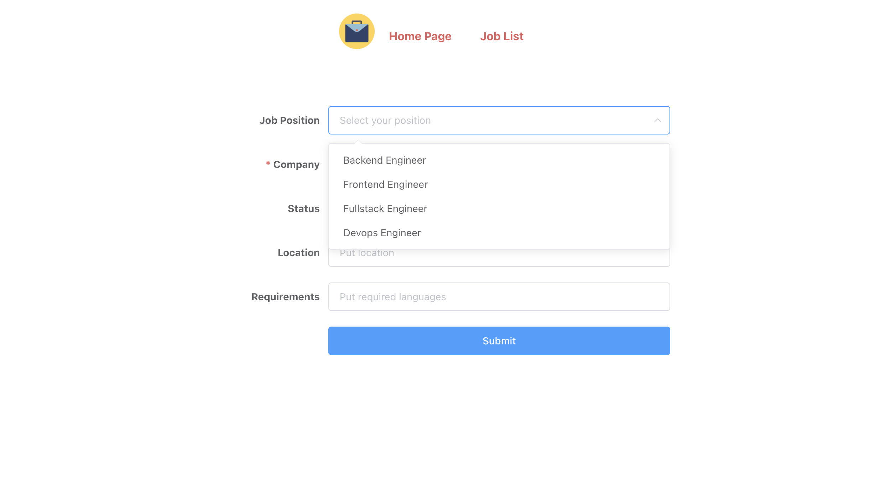

## Job Application Tracker

📅 You might have to apply job for multiple companies at the same time and you want to have somewhere to track entire process,
this is for you.




### Technologies used

- Typescript
- Docker
- VueJS
- Postgres
- ModuleAlias
- Socket.io
- Nginx

## Project Structure

```bash
├── backend                     # backend for website
├── config                      # contains all env file for different environments
├── environment                 # dockerfile
└── frontend                    # containes vuejs code
```

## Project setup:

Add domain host to your host file
```bash
make host
```

Build docker image
```bash
make build
```

Start docker container
```bash
make up
```

Create DB table in Postgres
```bash
make db-create
```

Run migration on DB
```bash
make db-migrate
```

Start job tracker application
```bash
make prod
```

Access website by putting this domain on your browser
```bash
jobtracker.local
```
